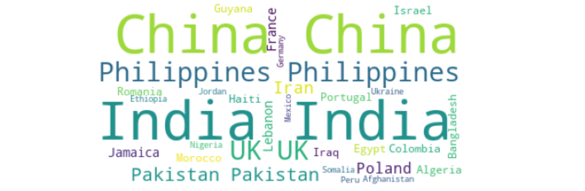

## Hands-on Practice Learning Lab for Data Science

### Overview
* * *
This hands on practice lab is a part of [Data Visualization with Python](https://www.coursera.org/learn/python-for-data-visualization?) course offered by [Coursera.org](https://www.coursera.org/).

The present hands on lab mainly uses [Immigration to Canada dataset](https://developer.ibm.com/exchanges/data/all/airline/) and employs the following advanced visualization tools to display relations between features within the dataset:   
* Bubble plot  
* Waffle chart  
* Word cloud  
* Map plot using Folium  
* Choropleth plot using Folium  
* Sunburst plot using Plotly  
* Treemap plot using Plotly  

✓ Link to the Immigration to Canada dataset: [Link](https://cf-courses-data.s3.us.cloud-object-storage.appdomain.cloud/IBMDeveloperSkillsNetwork-DV0101EN-SkillsNetwork/Data%20Files/Canada.xlsx)  
✓ Link to the notebook: [Link](https://github.com/Farhad-Davaripour/Advanced_Data_Visualization_Tools/blob/main/Notebook.ipynb)   

## About The Author

- Farhad Davaripour is a finite element specialist/data science enthusiast with near 3 years of experience working in research and development roles. He has a knack for problem-solving and passion for data science (He is certified with [IBM Data Science Professional Certificate](https://coursera.org/share/d7d1a76ed251437131fd33bba91bb9d9)).
- Connect with Farhad on [LinkedIn](https://www.linkedin.com/in/farhad-davaripour/).
